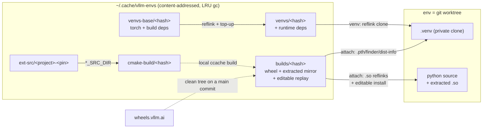

# vllm-envs (`ve`)

Fast disposable vLLM dev environments from any branch/commit, built on content-addressed layer caches. Spin up an agent workspace in seconds; hop commits (including `git bisect`) without re-paying dependency installs or CUDA builds.

## Install

```bash
uv tool install --editable /path/to/vllm-envs   # or: uv pip install -e .
```

Requires: `uv`, `ccache`, git ≥ 2.15. Reflink-capable filesystem (XFS/btrfs) recommended; falls back to plain copies otherwise.

## Usage

Worktree-native workflow — manage your clone in place, and every new worktree becomes an env automatically:

```bash
git clone https://github.com/vllm-project/vllm && cd vllm
ve init                     # manage this checkout in place: venv + extensions from cache
source .venv/bin/activate   # plain venv activation — always works
git worktree add ../my-feature my-branch   # auto-runs ve init in the new worktree
cd ../my-feature && source .venv/bin/activate
```

Optionally add `eval "$(ve shellenv)"` to your shell rc (bash/zsh); then `ve activate` sources the env's venv into your current shell from anywhere inside it, and `deactivate` works as usual.

Or spawn disposable envs by ref:

```bash
cd /path/to/vllm            # your vLLM clone
ve new main                 # env from main
ve new v0.13.0 --name bisect1
cd ~/vllm-envs/bisect1
source .venv/bin/activate   # or `ve activate` with shellenv installed
git checkout <sha>          # post-checkout hook auto-syncs layers
git bisect start ...        # works transparently
ve status                   # layer hashes + cache state
ve rm bisect1               # for `ve init` envs: unmanages, never deletes your checkout
ve gc --dry-run             # LRU cache pruning (50GB default cap)
ve du [--entries]           # usage audit: per store, uv cache/ccache, hardlink sharing, live envs
```

Auto-init on `git worktree add` fires only for worktrees of a repo where the hook is installed (`ve init` or `ve new` installs it); set `VE_NO_AUTO_INIT=1` to skip it for one command.

## How it works

An env is just a git worktree plus a private `.venv`, assembled from shared content-addressed stores under `~/.cache/vllm-envs/`:

| Store | Contents | Keyed by |
|---|---|---|
| `venvs-base/` | torch + build deps | build requirements + torch pins + python/CUDA version |
| `venvs/` | full deps (derived from `venvs-base`) | base key + runtime requirements |
| `ext-src/` | pinned external sources (cutlass, flash-attn, ...) | project + pin parsed from the worktree's cmake files |
| `builds/` | compiled-extension wheel + extracted-file mirror + editable-install replay | content hash of csrc/ cmake/ CMakeLists.txt setup.py (+ python/CUDA) |
| `cmake-build/` | persistent cmake trees for incremental local builds | same hash as `builds/` |



`ve sync` (run by `ve new`/`ve init` and the post-checkout hook) resolves three layers, skipping whatever is already consistent:

1. **venv** — requirements files are hashed; on a hit the env's `.venv` is reflink-cloned from the cached template (CoW: edit site-packages freely, other envs are unaffected). Templates are derived `venvs-base` → `venvs`, so a runtime-requirements change only re-installs the delta. On a commit hop the private venv is converged in place (top-up install + uninstall of dropped deps).
2. **build** — csrc/cmake/setup.py content is hashed. Clean-tree resolution order: store hit → precompiled wheel from wheels.vllm.ai (when the tree matches the origin/main merge-base; published into the store) → local ccache build, with `ext-src/` pins injected via `*_SRC_DIR` env vars and a persistent per-hash cmake tree for incremental rebuilds. Dirty csrc/ or user `*_SRC_DIR` overrides → private builds, never published.
3. **attach** — makes the worktree importable as an editable install: the wheel's `.so` files and bundled third-party py files are placed into the worktree as reflinks of the shared mirror in `builds/<hash>/extracted/` (~450MB physical shared per env), and the editable-install artifacts (`.pth`, finder, dist-info) are written into the venv. The first attach at a build hash runs vLLM's own setup.py once (historically correct extraction for old releases) and captures the result; later attaches at the same commit replay it with no setup.py run, and an already-attached env is a no-op.

Warm-cache timing: fresh `ve new`/`ve init` ~7s, no-op `ve sync` ~1s; a cold build costs one normal vLLM build, then every env at that hash shares it.

## Config

`~/.cache/vllm-envs/config.toml`:

```toml
[cache]
max_size_gb = 50       # VE_MAX_SIZE_GB overrides; enforced on physical usage (blocks apportioned by hardlink count)
min_age_hours = 72

[core]
envs_root = "~/vllm-envs"   # VE_ENVS_ROOT overrides
python = "3.12"
```

Env vars: `VE_CACHE_DIR`, `VE_NO_SYNC=1` (skip hook sync, warn instead).

## Caveats (v1)

- Requirements top-up on commit hop converges the env venv (installs the delta, uninstalls deps dropped from the template resolution); user-added packages survive, but for a guaranteed-clean venv use `ve sync --fresh-venv`.
- The upstream precompiled-wheel fallback (`VLLM_USE_PRECOMPILED`) is used when a local build fails; those artifacts are not captured into the store.
- Old refs resolve historically-correct *pins*, but unpinned transitive deps (e.g. transformers ranges) resolve to current versions, which can break serving on old releases — that's a vLLM requirements property, not an env-tool one.
