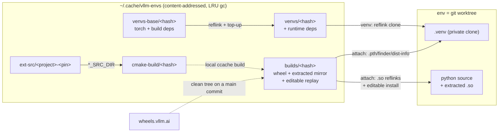

# vllm-envs (`ve`)

Fast disposable vLLM dev environments from any branch/commit, built on content-addressed layer caches. Spin up an agent workspace in seconds; hop commits (including `git bisect`) without re-paying dependency installs or CUDA builds.

## Install

```bash
uv tool install --editable /path/to/vllm-envs   # or: uv pip install -e .
```

Requires: `uv`, `ccache`, git ≥ 2.15. Reflink-capable filesystem (XFS/btrfs) recommended; falls back to plain copies otherwise.

## Usage

**Manage a clone in place** — build + deps assembled from cache into `./.venv`:

```bash
cd vllm                     # your vLLM clone
ve init
source .venv/bin/activate   # plain venv — always works
```

**New worktrees become envs automatically.** After `ve init` (or `ve new`) has run once in a repo, its worktree hook auto-initializes every new worktree:

```bash
git worktree add ../my-feature my-branch   # auto-runs ve init
cd ../my-feature && source .venv/bin/activate
```

**Or spawn disposable envs by ref** (created under `~/vllm-envs/`):

```bash
ve new main                 # env from main
ve new v0.13.0 --name bisect1
```

Inside an env you can `git checkout <sha>` / `git bisect` freely — a hook re-syncs the layers on each hop. Optionally add `eval "$(ve shellenv)"` to your shell rc, then `ve activate` sources the venv from anywhere inside an env.

**Everyday commands:**

| Command | What it does |
|---|---|
| `ve status` | layer hashes + cache state for the current env |
| `ve sync` | re-resolve layers for the current worktree HEAD |
| `ve list` | list live envs |
| `ve rm <name>` | remove an env (`ve init` envs are unmanaged, never deleted) |
| `ve reap` | list worktrees; reap stale ones (see below) |
| `ve gc [--dry-run]` | LRU cache pruning (100GB default cap, on physical usage) |
| `ve du` | disk audit: logical vs reflink-aware physical, per store/env |

## Using with t3code

t3code creates a git worktree per session under `~/.t3/worktrees/<repo>/`. Because auto-init fires on `git worktree add`, each session gets a ready `.venv` from cache automatically — just install the hook once in your clone:

```bash
cd ~/local/vllm && ve init   # once; installs the worktree hook
```

Archiving a t3code session leaves its worktree on disk. `ve reap` finds and prunes them:

```bash
ve reap             # list every worktree: state (active/archived/deleted/orphan),
                    #   last activity, dirty count, push status, and reap safety
ve reap --stale     # remove all archived/deleted/orphan worktrees...
                    #   ...but only the clean AND pushed/merged ones
ve reap <name>      # reap one by name or path
```

Reaping is gated: a worktree with uncommitted changes or un-pushed commits is skipped (add `--force` to override, `--dry-run` to preview). Active, primary, and non-t3 worktrees are never touched without `--force`.

Set `VE_NO_AUTO_INIT=1` to skip auto-init for a single `git worktree add`.

## How it works

An env is just a git worktree plus a private `.venv`, assembled from shared content-addressed stores under `~/.cache/vllm-envs/`:

| Store | Contents | Keyed by |
|---|---|---|
| `venvs-base/` | torch + build deps | build requirements + torch pins + python/CUDA version |
| `venvs/` | full deps (derived from `venvs-base`); test deps too when `[venv] test` is on | base key + runtime (+ test) requirements |
| `ext-src/` | pinned external sources (cutlass, flash-attn, ...) | project + pin parsed from the worktree's cmake files |
| `builds/` | compiled-extension wheel + extracted-file mirror + editable-install replay | content hash of csrc/ cmake/ CMakeLists.txt setup.py (+ python/CUDA) |
| `cmake-build/` | persistent cmake trees for incremental local builds | same hash as `builds/` |



`ve sync` (run by `ve new`/`ve init` and the post-checkout hook) resolves three layers, skipping whatever is already consistent:

1. **venv** — requirements files are hashed; on a hit the env's `.venv` is reflink-cloned from the cached template (CoW: edit site-packages freely, other envs are unaffected). Templates are derived `venvs-base` → `venvs`, so a runtime-requirements change only re-installs the delta. On a commit hop the private venv is converged in place (top-up install + uninstall of dropped deps).
2. **build** — csrc/cmake/setup.py content is hashed. Clean-tree resolution order: store hit → precompiled wheel from wheels.vllm.ai (when the tree matches the origin/main merge-base; published into the store) → local ccache build, with `ext-src/` pins injected via `*_SRC_DIR` env vars and a persistent per-hash cmake tree for incremental rebuilds. Dirty csrc/ or user `*_SRC_DIR` overrides → private builds, never published.
3. **attach** — makes the worktree importable as an editable install: the wheel's `.so` files and bundled third-party py files are placed into the worktree as reflinks of the shared mirror in `builds/<hash>/extracted/` (~450MB physical shared per env), and the editable-install artifacts (`.pth`, finder, dist-info) are written into the venv. The first attach at a build hash runs vLLM's own setup.py once (historically correct extraction for old releases) and captures the result; later attaches at the same commit replay it with no setup.py run, and an already-attached env is a no-op.

Warm-cache timing: fresh `ve new`/`ve init` ~7s, no-op `ve sync` ~1s; a cold build costs one normal vLLM build, then every env at that hash shares it.

## Config

`~/.cache/vllm-envs/config.toml`:

```toml
[cache]
max_size_gb = 100      # VE_MAX_SIZE_GB overrides; enforced on reflink-aware physical usage
min_age_hours = 72

[core]
envs_root = "~/vllm-envs"   # VE_ENVS_ROOT overrides
python = "3.12"

[venv]
cap = "minor"   # cap unpinned requirement floors: minor | major | none (VE_CAP overrides)
test = true     # install & cache requirements/test/<platform>.txt into the full venv
                #   (prefers the pinned .txt, falls back to .in); VE_WITH_TEST overrides
```

With `test = true` (the default) the `venvs/` layer also installs vLLM's test
dependencies (`pytest`, `lm-eval`, ...), cached and reflink-shared like the rest;
set `test = false` (or `VE_WITH_TEST=0`) to keep envs lean.

Env vars: `VE_CACHE_DIR`, `VE_NO_SYNC=1` (skip hook sync, warn instead).

## Caveats (v1)

- Requirements top-up on commit hop converges the env venv (installs the delta, uninstalls deps dropped from the template resolution); user-added packages survive, but for a guaranteed-clean venv use `ve sync --fresh-venv`.
- The upstream precompiled-wheel fallback (`VLLM_USE_PRECOMPILED`) is used when a local build fails; those artifacts are not captured into the store.
- Unpinned requirement floors (e.g. `transformers>=4.5`) are capped near their era at resolve time: by default each floored-but-uncapped requirement gets an upper bound at the next minor (`>=4.5` → `<4.6`); `cap = "major"` bounds at the next major, `"none"` restores resolve-to-latest. When the caps are mutually unsatisfiable (stale floors), ve automatically falls back minor → major → none with a warning. The cap mode folds into the venv template key.
